# ml-tech-fiap-vitivinicultura-api [tech challenge]
Esta API fornece acesso a dados detalhados sobre a produção, processamento, comercialização, importação e exportação de vinhos. Além disso, oferece uma aplicação para visualização interativa de dados, auxiliando na tomada de decisões e no entendimento do comportamento de exportação. A aplicação também realiza previsões sobre o preço e a quantidade de vinhos exportados por país.

Este repositório foi desenvolvido como parte do **Tech Challenge da Pós-Graduação em Engenharia de Machine Learning da FIAP**, com objetivos acadêmicos e educacionais.

## **Índice**
- [Funcionalidades](#funcionalidades)
- [Tecnologias Utilizadas](#tecnologias-utilizadas)
- [Pré-requisitos](#pré-requisitos)
- [Instalação](#instalação)
- [Documentação da API](#documentação-da-API)
- [Uso](#uso)
- [Autenticação](#autenticação)
- [Endpoints](#endpoints)
- [Deploy](#deploy)
- [Monitoramento](#monitoramento)
- [Previsão de Exportação de Vinhos por País](#predição*)
- [Arquitetura](#Arquitetura)
- [Licença](#licença)

---

## **Funcionalidades**
- Consultar dados históricos e em tempo real sobre vitivinicultura.
- Monitorar a produção de vinhos no Brasil.
- Acessar informações detalhadas sobre a comercialização e exportação de vinhos.
- Utilizar dados para alimentar modelos de previsão de exportacao de vinhos 
- Modelo preditivo para prever exportacao de vinho (TECH CHALLENGE - FASE 3)

---

## **Tecnologias Utilizadas**
- **FastAPI**: Framework de alto desempenho para construção de APIs em Python.
- **JWT (JSON Web Tokens)**: Utilizado para autenticação segura.
- **Railway**: Plataforma de deploy em nuvem.
- **Docker**: Ferramenta para criar e gerenciar containers, facilitando o ambiente de desenvolvimento e deploy.
- **Docker Compose**: Utilizado para definir e executar múltiplos containers.
- **Python 3.12+**: Linguagem de programação utilizada no desenvolvimento da API.

## **Pré-requisitos**
Antes de começar, certifique-se de ter os seguintes pré-requisitos instalados em sua máquina:
- **Python 3.12+**: [Instalar Python](https://www.python.org/downloads/)
- **Git**: [Instalar Git](https://git-scm.com/book/en/v2/Getting-Started-Installing-Git)
- **Docker**: [Instalar Docker](https://docs.docker.com/get-docker/)
- **Docker Compose**: [Instalar Docker Compose](https://docs.docker.com/compose/install/)

---

## **Instalação**

### **Passo a passo para Instalação Local**
1. Clone o repositório:
```bash
   git clone https://github.com/diegoalber1/ml-tech-fiap-vitivinicultura-api.git
   cd ml-tech-fiap-vitivinicultura-api 
```
2. Crie e ative um ambiente virtual:
Para Mac e Linux:
```bash
   python3 -m venv venv
   source venv/bin/activate
```   
Para Windows:
```bash
   python3 -m venv venv
   source venv/bin/activate
```   
3. Instale as dependências:
```bash
   pip install -r requirements.txt
```   
4. Crie o arquivo .env e configure as variáveis de ambiente citadas na seção #configuração# :
```bash
   touch .env   # Para Mac e Linux

   echo.> .env  # Para Windows
```   
5. Certifique-se de configurar as seguintes variáveis de ambiente no arquivo `.env`:
- `SECRET_KEY`: Chave secreta para geração de tokens JWT.
- `ALGORITHM`: Algoritmo utilizado para assinar os tokens JWT (ex: HS256).
- `ACCESS_TOKEN_EXPIRE_MINUTES`: Tempo de expiração do token de acesso.
- `DEBUG`: Define se o modo de depuração está ativado (True/False).

Exemplo de arquivo `.env`:

```bash
SECRET_KEY=supersecretkey
ALGORITHM=HS256
ACCESS_TOKEN_EXPIRE_MINUTES=30
DEBUG=False
```

6. Execute a aplicação localmente:
```bash
   uvicorn app.main:app --reload
```   
Agora, a API estará rodando localmente no endereço http://127.0.0.1:8000.

### **Executar Testes**
Para garantir que tudo está funcionando corretamente, você pode executar os testes automatizados:

```bash
   pytest
```

### **Passo a passo para Instalação no Docker**
1. **Certifique-se de que o Docker está instalado**:
   - Verifique se você tem o Docker instalado em sua máquina. Caso não tenha, você pode seguir as instruções de instalação [aqui](https://docs.docker.com/get-docker/).

2. **Clone o repositório**:
```bash
   git clone https://github.com/diegoalber1/ml-tech-fiap-vitivinicultura-api.git
   cd ml-tech-fiap-vitivinicultura-api
```

3. **Crie um arquivo `.env` na raiz do projeto**:
```bash
   SECRET_KEY=supersecretkey
   ALGORITHM=HS256
   ACCESS_TOKEN_EXPIRE_MINUTES=30
   DEBUG=False
```
4. **Construir a imagem Docker**:
```bash
   docker build -t vitivinicultura-api .
```
5. **Executar o container:**:
```bash
   docker run -d -p 8000:8000 --env-file .env --name vitivinicultura-api vitivinicultura-api
```
6. **Acessar a API:**:
A API estará disponível em [http://localhost:8000](http://localhost:8000). 


## **Uso**

### **Autenticação**
A API utiliza **JWT (JSON Web Tokens)** para autenticação. Para acessar os endpoints protegidos, você precisa obter um token de acesso.

1. **Obter o Token de Acesso (Login)**:
```bash
   curl -X 'POST' \
   'http://localhost:8000/token' \
   -H 'Content-Type: application/x-www-form-urlencoded' \
   -d 'username=seu_usuario&password=sua_senha'
```

**⚠️ Importante**: Para fins de testes nesta API, utilize as seguintes credenciais:
- **username**: fiap
- **password**: mltech

2. **Acessar o Endpoint Protegido**:
```bash
   curl -X 'GET' \
   'http://localhost:8000/users/me' \
   -H 'Authorization: Bearer seu_token_jwt_aqui'
```
Substitua seu_token_jwt_aqui pelo token JWT que você obteve no passo anterior.

3. **Acessar o API no Railway**:
Para fins de avaliação, essa API se encontra disponível no Railway através deste [link](https://web-production-35d2.up.railway.app).


**Fluxo de Autenticação**:

. O cliente envia uma requisição de login com as credenciais para o endpoint `/token`.\
. A API valida as credenciais e, se forem válidas, gera um token JWT.\
. O cliente usa o token JWT para acessar os endpoints protegidos.\ 
. A API valida o token JWT em cada requisição protegida.\
. Se o token for válido, a API permite o acesso ao recurso solicitado. Caso contrário, retorna um erro de autenticação.

### **Documentação da API**
A documentação da API está disponível no formato OpenAPI. Você pode visualizar o arquivo JSON completo [aqui](./docs/openapi.json).

**Endpoints**
 
- **`GET /producao/{year}`** Retorna dados de produção de vitivinicultura.
- **`GET /processamento/{year}`** Retorna dados de processamento de vitivinicultura.
- **`GET /comercializacao/{year}`** Retorna dados de comercialização de vitivinicultura.
- **`GET /importacao/{year}`** Retorna dados de importação de vitivinicultura.
- **`GET /exportacao/{year}`** Retorna dados de exportação de vitivinicultura. 
- **`GET /csv/producao:`** Retorna o conteudo do arquivo csv convertido em json de todos os dados de producao de vitivinicultura.
- **`GET /csv/processamento:`** Retorna o conteudo do arquivo csv convertido em json de todos os dados de processamento de vitivinicultura.
- **`GET /csv/comercializacao:`** Retorna o conteudo do arquivo csv convertido em json de todos os dados de comercializacao de vitivinicultura.
- **`GET /csv/importacao:`** Retorna o conteudo do arquivo csv convertido em json de todos os dados de importacao de vitivinicultura.
- **`GET /csv/exportacao:`** Retorna o conteudo do arquivo csv convertido em json de todos os dados de exportacao de vitivinicultura.
- **`POST /token:`** Gera o JWT token para autenticação
- **`GET /users/me:`** Retorna os dados do usuário autenticado.
- **`GET /docs:`** Retorna a documentação da API.


## **Deploy**

### **Deploy no Railway***
1. **Acesse o Railway**
   - Visite [Railway](https://railway.app) e crie uma conta ou faça login.

2. **Criar Novo Projeto**
   - Clique em "New Project" e selecione "Deploy from GitHub".

3. **Conectar ao Repositório**
   - Escolha o repositório onde seu projeto está hospedado.

4. **Configurar Variáveis de Ambiente**
   - No painel do Railway, vá até "Settings" e adicione as variáveis de ambiente necessárias, como `SECRET_KEY`, `ALGORITHM`, `ACCESS_TOKEN_EXPIRE_MINUTES` e `DEBUG`.

5. **Deploy**
   - Após a configuração, o Railway irá automaticamente iniciar o processo de deploy. Você poderá visualizar os logs e o status da aplicação no painel.

6. **Acessar a Aplicação**
   - Assim que o deploy for concluído, você poderá acessar sua aplicação pelo URL fornecido pelo Railway. [Neste se encontra uma instância para fins de avaliação](https://web-production-35d2.up.railway.app/)

## **Monitoramento**
- O Railway oferece métricas integradas e logs que podem ser acessados diretamente no painel para monitorar o desempenho da aplicação.


## **Predição**

Esta aplicação tem como objetivo prever os valores e a quantidade de exportação de vinhos por país utilizando técnicas de Machine Learning. O modelo foi desenvolvido com base em dados históricos de exportação de vinhos, sendo avaliado por métricas como **Erro Quadrático Médio (MSE)**, **R²** e **Erro Absoluto Percentual Médio (MAPE)**.

### Tecnologias Utilizadas

- **Python 3.x**
- **Bibliotecas**:
  - Pandas
  - NumPy
  - Matplotlib
  - Seaborn
  - scikit-learn
  - SQLAlchemy
  - joblib
- **Banco de Dados**: PostgreSQL

### Etapas do Projeto

#### 1. **Configuração do Ambiente**

O ambiente foi configurado com o uso de bibliotecas essenciais para a manipulação de dados (Pandas, NumPy), visualização (Matplotlib, Seaborn), e construção do modelo de Machine Learning (scikit-learn). A conexão com o banco de dados foi feita utilizando SQLAlchemy, com credenciais armazenadas como variáveis de ambiente.

#### 2. **Carregamento, Preparação dos Dados e Feature Engineering**

Os dados foram extraídos de um banco de dados PostgreSQL contendo informações sobre exportação de vinhos por país. Após o carregamento, os dados foram limpos, removendo ou corrigindo valores ausentes, inválidos ou inconsistentes. Durante essa etapa, também foram realizadas transformações nas variáveis, como a criação de novos atributos baseados em dados existentes (exemplo: média do valor por litro e variação anual).

#### 3. **Análise Exploratória de Dados (EDA)**

Foi realizada uma análise exploratória para entender a distribuição dos dados e suas correlações. A partir disso, gráficos e estatísticas descritivas foram gerados para identificar padrões e possíveis outliers. A análise incluiu a visualização das distribuições das variáveis e a análise das correlações entre as variáveis numéricas, como a quantidade de vinhos exportados e o valor total da exportação.

#### 4. **Divisão dos Dados**

Os dados foram divididos em duas partes: variáveis de entrada (características, como o país e ano da exportação) e variáveis de saída (quantidade de vinhos e valor total em USD). Em seguida, o conjunto de dados foi separado em dados de treinamento e dados de teste, garantindo que o modelo fosse avaliado de forma justa.

#### 5. **Treinamento do Modelo**

Para a construção do modelo de previsão, foi escolhido o algoritmo **Random Forest Regressor**, uma técnica baseada em árvores de decisão que é robusta e eficiente para problemas com múltiplas variáveis. O modelo foi treinado com os dados de entrada, e um pipeline foi utilizado para garantir que a codificação das variáveis categóricas e o pré-processamento dos dados fossem realizados de forma correta.

#### 6. **Avaliação do Modelo**

O modelo foi avaliado utilizando três métricas principais:
- **MSE (Erro Quadrático Médio)**: Mede a média dos quadrados das diferenças entre as previsões e os valores reais. Quanto menor, melhor.
- **R² (Coeficiente de Determinação)**: Indica a proporção da variância dos dados que o modelo consegue explicar. Quanto mais próximo de 1, melhor o modelo.
- **MAPE (Erro Absoluto Percentual Médio)**: Mede a média dos erros percentuais absolutos entre as previsões e os valores reais. Quanto menor, melhor.

Essas métricas ajudaram a determinar a eficácia do modelo e seu desempenho em prever os valores de exportação de vinhos.

#### 7. **Persistência do Modelo**

Após o treinamento, o modelo foi salvo em um arquivo para que possa ser reutilizado sem a necessidade de re-treinamento. Esse arquivo pode ser carregado posteriormente para fazer previsões em tempo real ou ser implementado em um ambiente de produção. Nesse cenario, o artefato treinamento é utilizado por uma API (exportacao/predict) e também em uma aplicação streamlit para realizar as predições

### Justificativa da Escolha do Algoritmo

A escolha do **Random Forest Regressor** foi baseada em várias considerações:

- **Capacidade de lidar com grandes volumes de dados**: O Random Forest pode lidar eficientemente com grandes conjuntos de dados, o que é crucial dado o tamanho potencial dos dados de exportação.
- **Modelagem de relações não lineares**: O algoritmo é capaz de capturar interações complexas entre as variáveis, o que é importante para a previsão de valores de exportação, onde as relações podem não ser lineares.
- **Robustez contra overfitting**: Como o modelo utiliza múltiplas árvores de decisão e realiza uma média entre elas, ele é menos propenso a overfitting (ajuste excessivo aos dados de treinamento).
- **Facilidade de interpretação**: O Random Forest fornece informações úteis sobre a importância das variáveis, o que permite entender quais fatores têm maior impacto nas previsões.


### **Aplicação de Previsão com Streamlit**


Esta aplicação tem como objetivo prever as exportações de vinhos com base em dados históricos. Utilizando um modelo de machine learning, o app oferece diversas funcionalidades para visualização de dados e análise preditiva.

#### Funcionalidades

O aplicativo é dividido em quatro menus principais:

1. **Mapa-Global**: Visualiza a distribuição das exportações por país através de um mapa interativo.
2. **Gráficos**: Exibe diferentes gráficos relacionados às tendências de exportação, correlação entre valor e quantidade, e exportações por região.
3. **Histórico**: Permite consultar o histórico de exportação de um país específico.
4. **Previsão**: Realiza previsões sobre a quantidade e o valor das exportações de um país.


#### Seção 1: Mapa-Global

Esta seção apresenta um **mapa interativo** de distribuição de exportações por país. O gráfico destaca a quantidade exportada, com a utilização de uma escala logarítmica para melhor visualização.

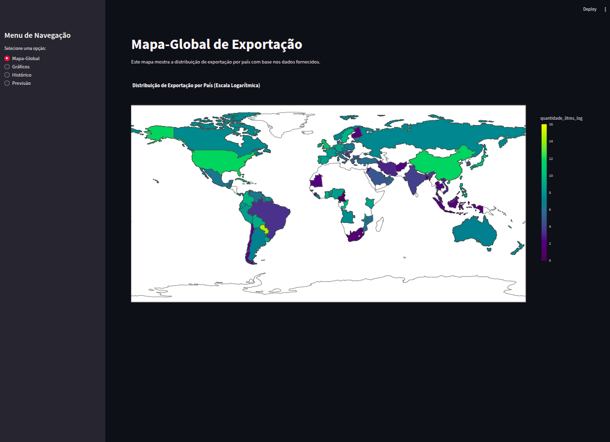


#### Seção 2: Gráficos

1. **Tendência Temporal de Exportação:**: Mostra a tendência da quantidade de exportações ao longo do tempo (anos).
2. **Exportações por Região**: Apresenta a quantidade de exportações distribuídas por região do mundo.
3. **Variação Anual (Quantidade e Valor)**: Exibe a variação anual da quantidade e do valor das exportações.
4. **Dispersão (Valor Médio por Litro vs. Quantidade)**: Mostra a relação entre o valor médio por litro e a quantidade exportada.

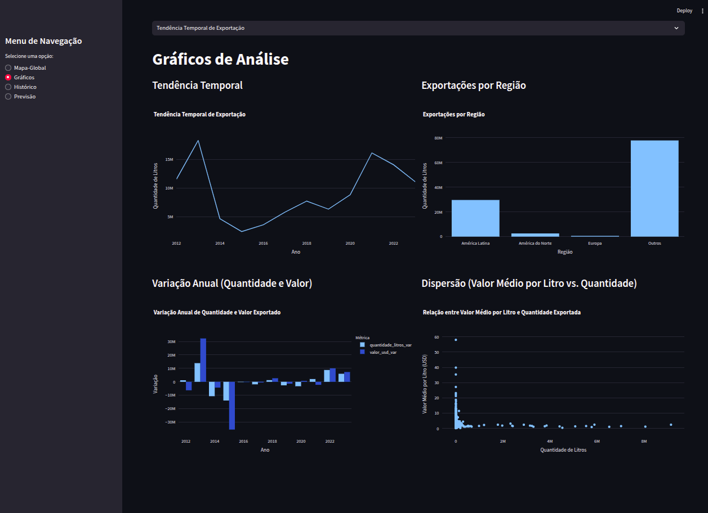


#### Seção 3: Histórico

Na seção de histórico, é possível consultar o histórico de exportações de vinhos para um país específico. A visualização é feita por meio de uma tabela interativa.


#### Seção 4: Previsão

A seção de **previsão** utiliza um modelo de machine learning treinado para prever a quantidade de litros e o valor em dólares das exportações para um país selecionado.


#### Tecnologias Utilizadas

- **Streamlit**: Framework para criar apps web interativos.
- **Plotly**: Biblioteca para gráficos interativos.
- **Seaborn**: Para visualização estatística e gráficos avançados.
- **Scikit-learn**: Biblioteca para machine learning, utilizada para o modelo preditivo.
- **Pandas e Numpy**: Para manipulação e análise de dados.


#### **Como Executar a Aplicação Streamlit**
1. Certifique-se de que o modelo `modelo_exportacao.pkl` está no diretório `ml-model/production`.
2. Execute o comando abaixo para iniciar a aplicação:
```bash
   streamlit run app/app.py
```
3. Acesse a aplicação no navegador no endereço [http://localhost:8501](http://localhost:8501)

## Arquitetura

### 1. Diagrama de Arquitetura de Software

Este diagrama mostra a visão geral do sistema, destacando os principais componentes e suas interações. O cliente faz requisições à API FastAPI, que, por sua vez, interage com o serviço de autenticação, rotas e serviços de dados, além de fontes de dados externas. Isso ajuda a entender a estrutura geral do sistema.

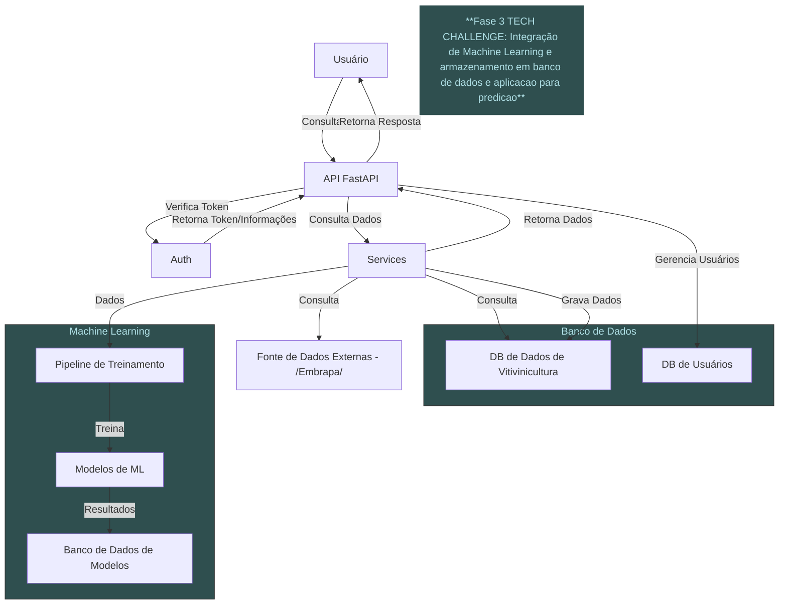
### 2. Diagrama de Componentes

Neste diagrama, são representados os componentes principais do sistema, incluindo FastAPI, serviços de autenticação, rotas e processamento de dados. Ele ilustra como esses componentes se conectam e interagem, facilitando a compreensão da modularidade da aplicação.

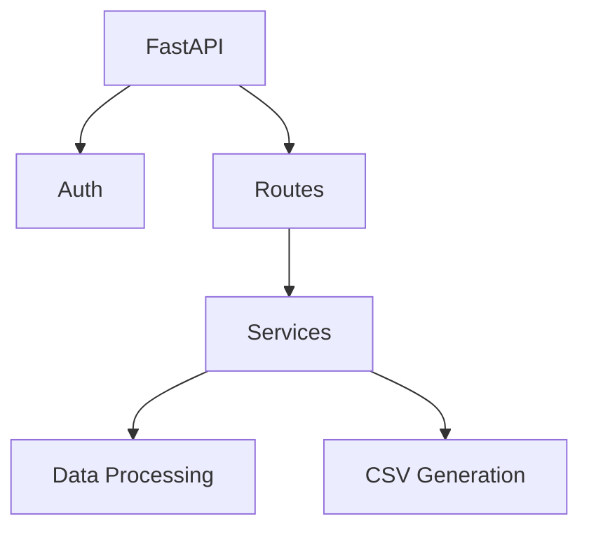
### 3. Diagrama de Fluxo de Dados (DFD)

O diagrama de fluxo de dados ilustra como as informações fluem entre o usuário e a API. O usuário envia credenciais à API de autenticação, que gera um token. O usuário utiliza esse token para solicitar dados, mostrando claramente o fluxo de informações no sistema.

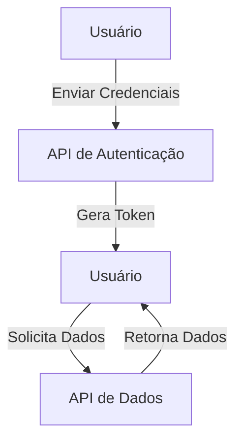
### 4. Diagrama de Sequência

Este diagrama representa a interação entre o usuário e os componentes do sistema ao longo do tempo. Ele detalha o processo de autenticação e a solicitação de dados, mostrando as chamadas de função e a ordem das operações, o que é útil para entender como as interações se desenrolam.

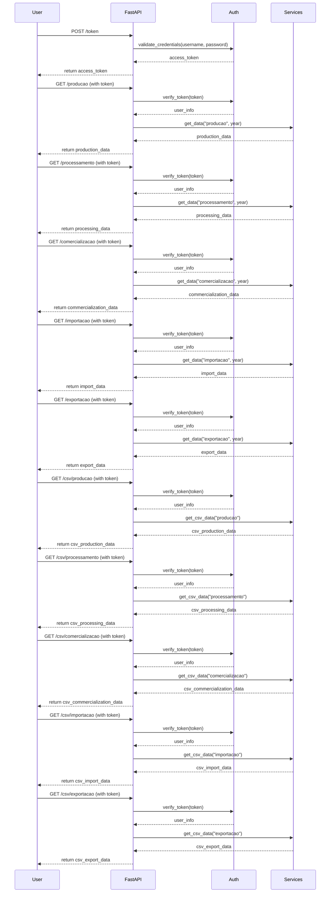
### 5. Diagrama de Casos de Uso

O diagrama de casos de uso apresenta as interações principais entre o usuário e a API. Ele mostra como os usuários podem se autenticar, consultar dados e gerar CSVs, facilitando a identificação das funcionalidades da aplicação.

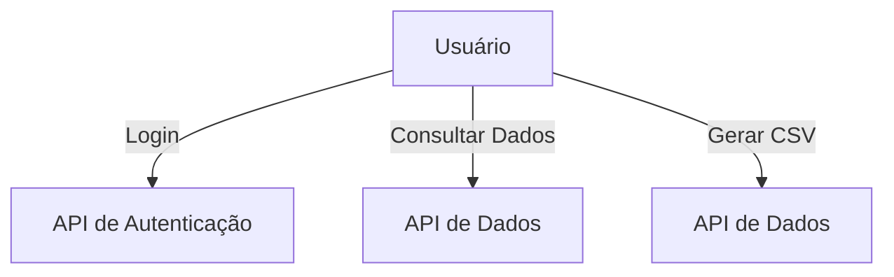
### 6. Diagrama de Classes (Estrutural)

Embora o projeto não utilize classes, este diagrama estrutura os principais módulos e funções da aplicação como se fossem classes. Isso ajuda a visualizar a organização do código e as dependências entre os diferentes componentes, destacando as funcionalidades disponíveis.

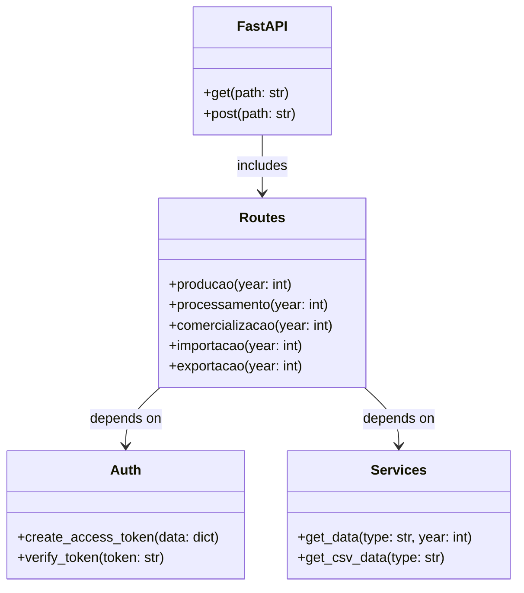
### 7. Diagrama de Implantação

O diagrama de implantação ilustra a arquitetura física do sistema, mostrando como o cliente interage com o servidor FastAPI, que se conecta a um banco de dados e a serviços externos. Isso é útil para entender a infraestrutura necessária para executar a aplicação.

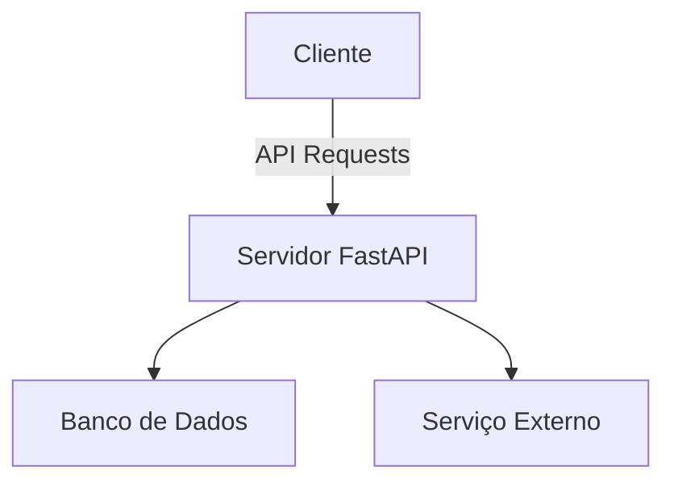

### 8. Diagrama de API

Este diagrama apresenta os principais endpoints da API e suas interações. Ele ilustra como as requisições são feitas para autenticação e consulta de dados, servindo como uma documentação visual para os desenvolvedores que utilizarão a API.


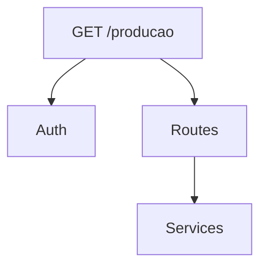

### 10. Diagrama de Arquitetura de Machine Learning

Este diagrama mostra a visão geral do pipeline de Machine Learning, destacando os principais componentes e suas interações. Ele ilustra como os dados fluem desde a entrada do usuário até a geração de previsões.
 
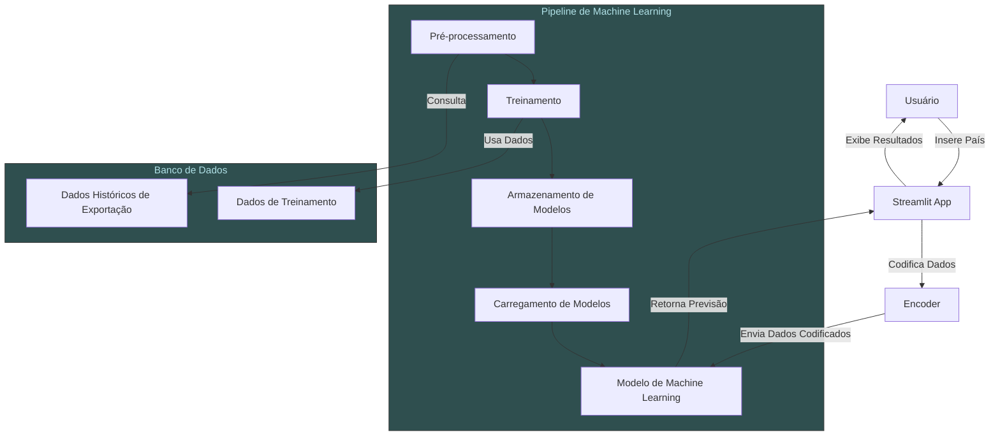

### 11. Diagrama de Fluxo de Previsão

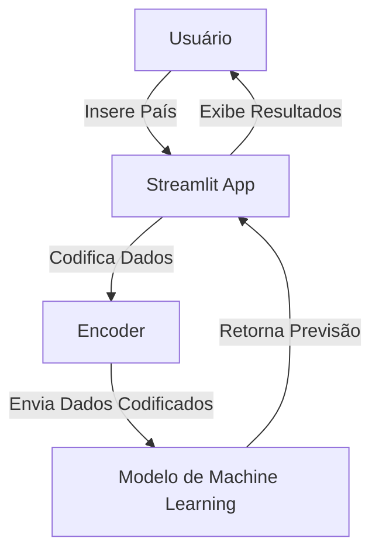

## Licença

Este projeto está licenciado sob a Licença MIT. Isso significa que você pode usar, copiar, modificar, mesclar, publicar, distribuir, sublicenciar e/ou vender cópias do software, desde que mantenha o aviso de copyright original. Para mais detalhes, consulte o arquivo [LICENSE](./LICENSE).
