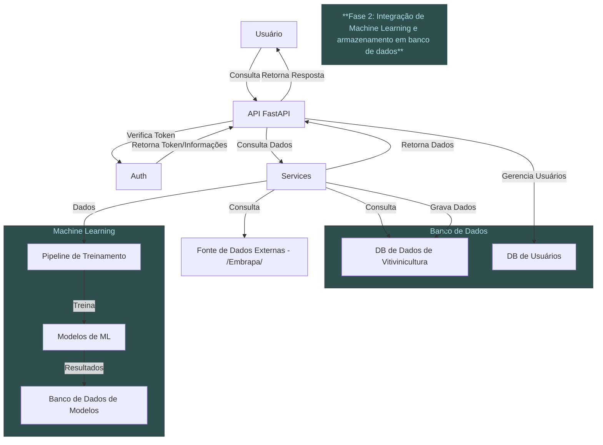
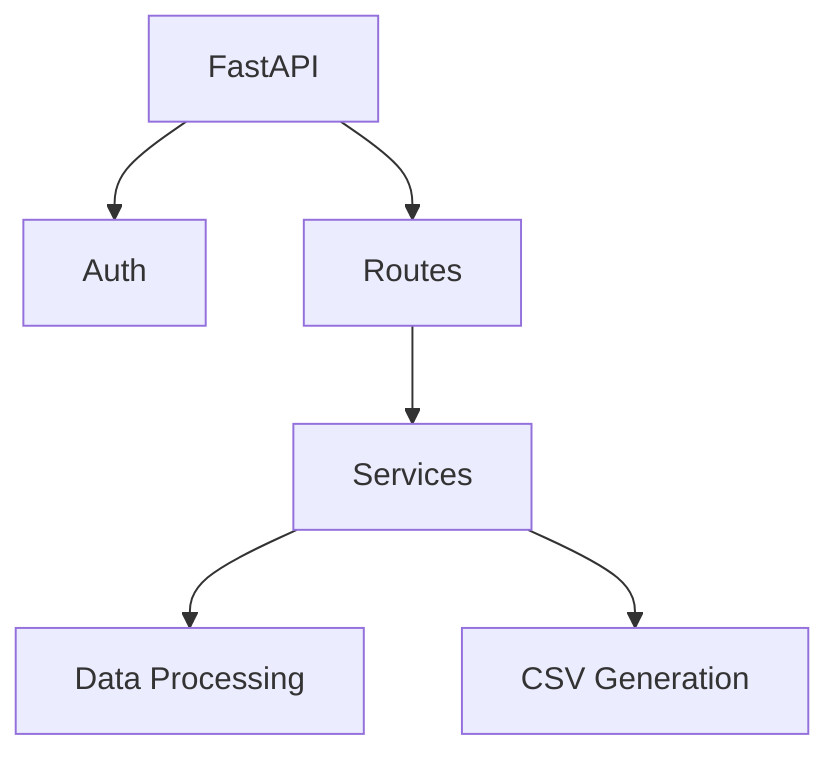
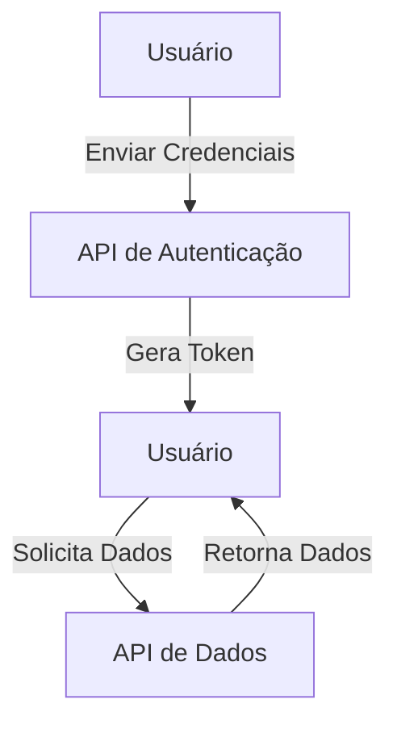
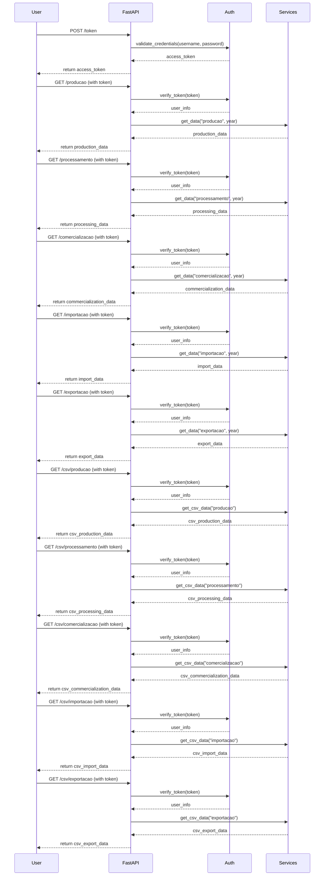
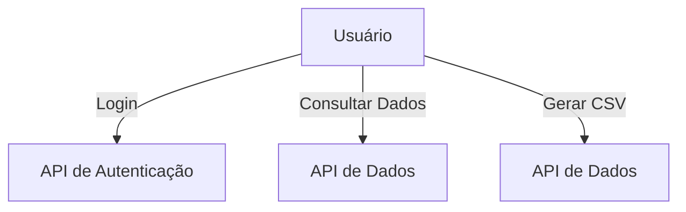
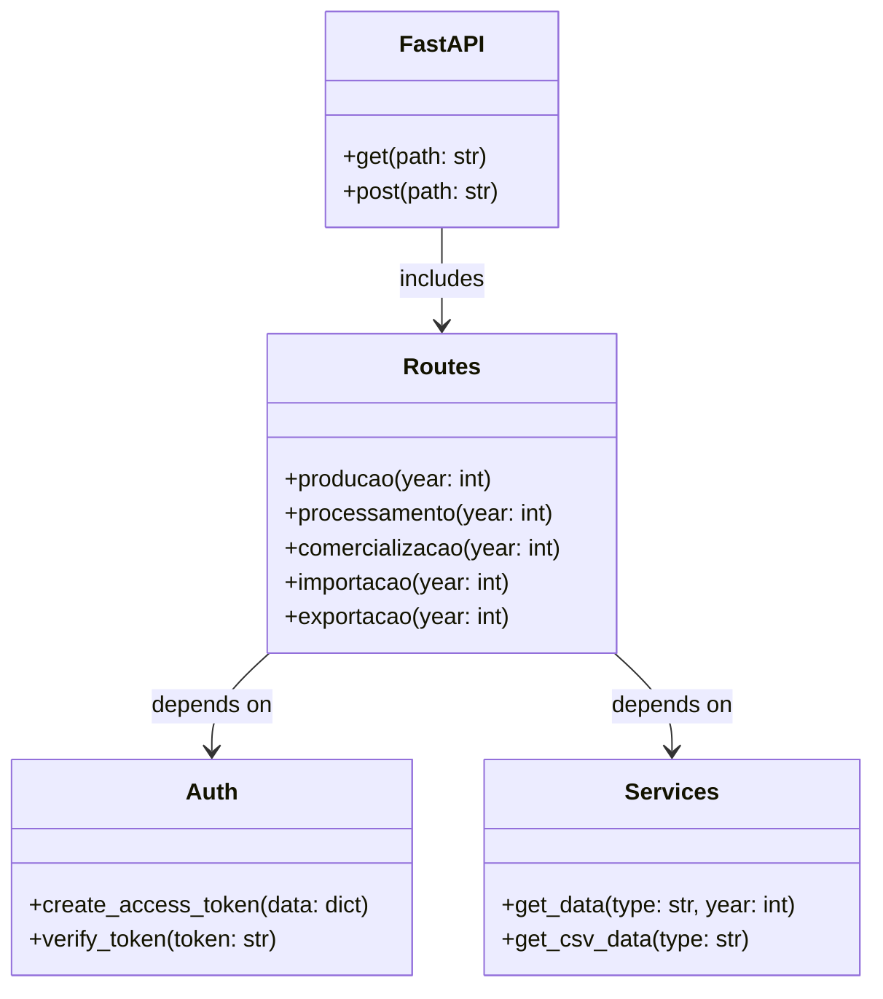
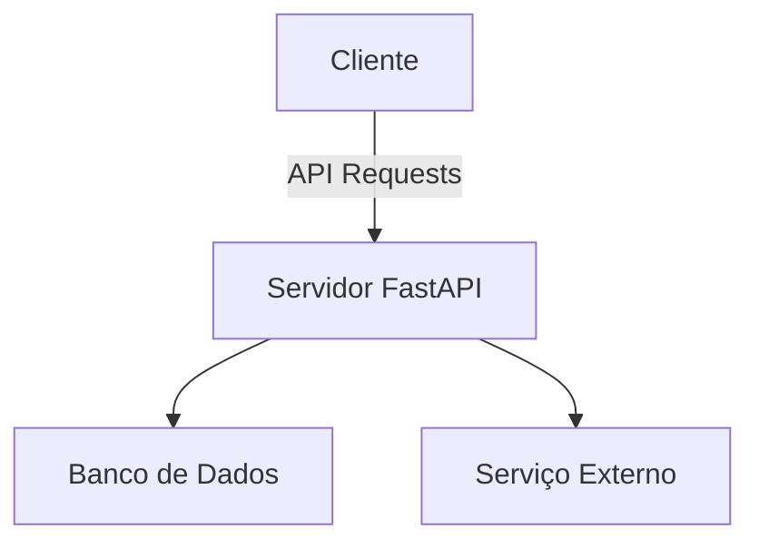
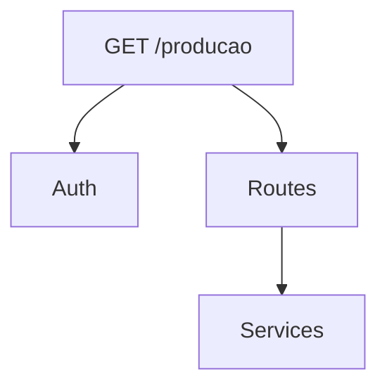

# RM358672-fiap-vitivinicultura-api- TECH CHALLENGE

Bem-vindo à **RM358672-fiap-vitivinicultura-api**. Esta API fornece acesso a dados relacionados à produção, processamento, comercialização, importação e exportação de vinhos. É uma ferramenta útil para profissionais da indústria vitivinícola, pesquisadores e entusiastas que desejam obter informações detalhadas sobre o setor. Este repositório foi criado para a realização do projeto do Tech Challenge da POS-Tech FIAP em Machine Learning Engineering e tem fins acadêmicos.

## **Índice**
- [Funcionalidades](#funcionalidades)
- [Tecnologias Utilizadas](#tecnologias-utilizadas)
- [Pré-requisitos](#pré-requisitos)
- [Instalação](#instalação)
- [Configuração](#configuração)
- [Documentação da API](#documentação-da-API)
- [Uso](#uso)
- [Autenticação](#autenticação)
- [Endpoints](#endpoints)
- [Testes](#testes)
- [Deploy](#deploy)
- [Monitoramento](#monitoramento)
- [Arquitetura](#Arquitetura)
- [Licença](#licença)

---

## **Funcionalidades**
- Consultar dados históricos e em tempo real sobre vitivinicultura.
- Monitorar a produção de vinhos no Brasil.
- Utilizar dados para alimentar modelos de previsão de demanda.
- Acessar informações detalhadas sobre a comercialização e exportação de vinhos.

---

## **Tecnologias Utilizadas**
- **FastAPI**: Framework de alto desempenho para construção de APIs em Python.
- **JWT (JSON Web Tokens)**: Utilizado para autenticação segura.
- **Heroku**: Plataforma de deploy em nuvem.
- **Python 3.12+**: Linguagem de programação utilizada no desenvolvimento da API.

---

## **Pré-requisitos**
Antes de começar, certifique-se de ter os seguintes pré-requisitos instalados em sua máquina:

- **Python 3.12+**: [Instalar Python](https://www.python.org/downloads/)
- **Git**: [Instalar Git](https://git-scm.com/book/en/v2/Getting-Started-Installing-Git)
- **Heroku CLI** (caso deseje realizar o deploy no Heroku): [Instalar Heroku CLI](https://devcenter.heroku.com/articles/heroku-cli)

---

## **Instalação**

### **Passo a passo para Instalação Local**
1. Clone o repositório:
```bash
   git clone https://github.com/diegoalber1/RM358672-fiap-vitivinicultura-api.git
   cd RM358672-fiap-vitivinicultura-api
```
2. Crie e ative um ambiente virtual:
Para Mac e Linux:
```bash
   python3 -m venv venv
   source venv/bin/activate
```   
Para Windows:
```bash
   python3 -m venv venv
   source venv/bin/activate
```   
3. Instale as dependências:
```bash
   pip install -r requirements.txt
```   
4. Crie o arquivo .env e configure as variáveis de ambiente citadas na seção #configuração# :
```bash
   touch .env   # Para Mac e Linux
   echo.> .env  # Para Windows
```   
5. Execute a aplicação localmente:
```bash
   uvicorn app.main:app --reload
```   
Agora, a API estará rodando localmente no endereço http://127.0.0.1:8000.

## **Configuração**

### **Variáveis de Ambiente**
Certifique-se de configurar as seguintes variáveis de ambiente no arquivo `.env`:


- `SECRET_KEY`: Chave secreta para geração de tokens JWT.
- `ALGORITHM`: Algoritmo utilizado para assinar os tokens JWT (ex: HS256).
- `ACCESS_TOKEN_EXPIRE_MINUTES`: Tempo de expiração do token de acesso.
- `DEBUG`: Define se o modo de depuração está ativado (True/False).

Exemplo de arquivo `.env`:

```bash
SECRET_KEY=supersecretkey
ALGORITHM=HS256
ACCESS_TOKEN_EXPIRE_MINUTES=30
DEBUG=True
```


## **Documentação da API**

A documentação da API está disponível no formato OpenAPI. Você pode visualizar o arquivo JSON [aqui](./docs/openapi.json).


## **Uso**

### **Autenticação**
A API utiliza **JWT (JSON Web Tokens)** para autenticação. Para acessar os endpoints protegidos, você precisa obter um token de acesso.

1. **Obter o Token de Acesso (Login)**:
```bash
   curl -X 'POST' \
   'http://localhost:8000/token' \
   -H 'Content-Type: application/x-www-form-urlencoded' \
   -d 'username=seu_usuario&password=sua_senha'
```

2. **Acessar o Endpoint Protegido**:

```bash
   curl -X 'GET' \
   'http://localhost:8000/users/me' \
   -H 'Authorization: Bearer seu_token_jwt_aqui'
```
Substitua seu_token_jwt_aqui pelo token JWT que você obteve no passo anterior.

**Fluxo de Autenticação**:

. O cliente envia uma requisição de login com as credenciais para o endpoint `/token`.\
. A API valida as credenciais e, se forem válidas, gera um token JWT.\
. O cliente usa o token JWT para acessar os endpoints protegidos.\ 
. A API valida o token JWT em cada requisição protegida.\
. Se o token for válido, a API permite o acesso ao recurso solicitado. Caso contrário, retorna um erro de autenticação.

## **Endpoints**
 

- **GET /producao:** Retorna dados de produção de vitivinicultura.
- **GET /processamento:** Retorna dados de processamento de vitivinicultura.
- **GET /comercializacao:** Retorna dados de comercialização de vitivinicultura.
- **GET /importacao:** Retorna dados de importação de vitivinicultura.
- **GET /exportacao:** Retorna dados de exportação de vitivinicultura. 
- **GET /csv/producao:** Retorna o conteudo do arquivo csv convertido em json de todos os dados de producao de vitivinicultura.
- **GET /csv/processamento:** Retorna o conteudo do arquivo csv convertido em json de todos os dados de processamento de vitivinicultura.
- **GET /csv/comercializacao:** Retorna o conteudo do arquivo csv convertido em json de todos os dados de comercializacao de vitivinicultura.
- **GET /csv/importacao:** Retorna o conteudo do arquivo csv convertido em json de todos os dados de importacao de vitivinicultura.
- **GET /csv/exportacao:** Retorna o conteudo do arquivo csv convertido em json de todos os dados de exportacao de vitivinicultura.
- **POST /token:** Retorna dados de exportação de vitivinicultura.
- **GET /users/me:** Retorna dados de exportação de vitivinicultura.
- **GET /docs:** Retorna a documentacao da API

## **Testes**

### **Executar Testes**
Para garantir que tudo está funcionando corretamente, você pode executar os testes automatizados:

1. **Instale as dependências de teste:**:
```bash
   pip install -r requirements-test.txt
```

2. **Execute os testes:**:

```bash
   pytest
```

## **Deploy**

### **Deploy no Heroku**
1. **Crie uma conta no Heroku (se ainda não tiver) e instale o Heroku CLI.**:

2. **Faça login no Heroku:**:
```bash
   heroku login
```
3. **Crie um novo app no Heroku:**:

```bash
   heroku create vitivinicultura-api   
```
4. **Configure as variáveis de ambiente no Heroku:**:

Configure as seguintes variáveis de ambiente no Heroku:

- `SECRET_KEY`: Chave secreta para geração de tokens JWT.
- `ALGORITHM`: Algoritmo utilizado para assinar os tokens JWT (ex: HS256).
- `ACCESS_TOKEN_EXPIRE_MINUTES`: Tempo de expiração do token de acesso.
- `DEBUG`: Define se o modo de depuração está ativado (True/False).

```bash
   heroku config:set SECRET_KEY=<sua_secret_key>
   heroku config:set ALGORITHM=HS256
   heroku config:set ACCESS_TOKEN_EXPIRE_MINUTES=30
   heroku config:set DEBUG=True
   
```
5. **Faça o deploy da aplicação:**:

```bash
   git push heroku main 
```
6. **Escale a aplicação:**:

```bash
   heroku ps:scale web=1  
```
7. **Acesse a aplicação:**:

```bash
   heroku open
```

## **Monitoramento**

### **Heroku Metrics**

O Heroku oferece métricas integradas para monitorar o desempenho da aplicação, como uso de CPU, memória e tempo de resposta. Essas métricas podem ser acessadas diretamente no painel do Heroku.

### **Heroku Logs**

Para visualizar os logs da aplicação, utilize o seguinte comando:

```bash
   heroku logs --tail
```

## Arquitetura

### 1. Diagrama de Arquitetura de Software

Este diagrama mostra a visão geral do sistema, destacando os principais componentes e suas interações. O cliente faz requisições à API FastAPI, que, por sua vez, interage com o serviço de autenticação, rotas e serviços de dados, além de fontes de dados externas. Isso ajuda a entender a estrutura geral do sistema.


### 2. Diagrama de Componentes

Neste diagrama, são representados os componentes principais do sistema, incluindo FastAPI, serviços de autenticação, rotas e processamento de dados. Ele ilustra como esses componentes se conectam e interagem, facilitando a compreensão da modularidade da aplicação.


### 3. Diagrama de Fluxo de Dados (DFD)

O diagrama de fluxo de dados ilustra como as informações fluem entre o usuário e a API. O usuário envia credenciais à API de autenticação, que gera um token. O usuário utiliza esse token para solicitar dados, mostrando claramente o fluxo de informações no sistema.


### 4. Diagrama de Sequência

Este diagrama representa a interação entre o usuário e os componentes do sistema ao longo do tempo. Ele detalha o processo de autenticação e a solicitação de dados, mostrando as chamadas de função e a ordem das operações, o que é útil para entender como as interações se desenrolam.


### 5. Diagrama de Casos de Uso

O diagrama de casos de uso apresenta as interações principais entre o usuário e a API. Ele mostra como os usuários podem se autenticar, consultar dados e gerar CSVs, facilitando a identificação das funcionalidades da aplicação.


### 6. Diagrama de Classes (Estrutural)

Embora o projeto não utilize classes, este diagrama estrutura os principais módulos e funções da aplicação como se fossem classes. Isso ajuda a visualizar a organização do código e as dependências entre os diferentes componentes, destacando as funcionalidades disponíveis.


### 7. Diagrama de Implantação

O diagrama de implantação ilustra a arquitetura física do sistema, mostrando como o cliente interage com o servidor FastAPI, que se conecta a um banco de dados e a serviços externos. Isso é útil para entender a infraestrutura necessária para executar a aplicação.



### 8. Diagrama de API

Este diagrama apresenta os principais endpoints da API e suas interações. Ele ilustra como as requisições são feitas para autenticação e consulta de dados, servindo como uma documentação visual para os desenvolvedores que utilizarão a API.




## Licença 

Este projeto está licenciado sob a Licença MIT. Isso significa que você pode usar, copiar, modificar, mesclar, publicar, distribuir, sublicenciar e/ou vender cópias do software, desde que mantenha o aviso de copyright original. Leia o arquivo [LICENSE](./LICENSE) para mais detalhes. --- MIT License Copyright (c) [2024] [Diego Alberone Permission is hereby granted, free of charge, to any person obtaining a copy
of this software and associated documentation files (the "Software"), to deal
in the Software without restriction, including without limitation the rights
to use, copy, modify, merge, publish, distribute, sublicense, and/or sell
copies of the Software, and to permit persons to whom the Software is
furnished to do so, subject to the following conditions: The above copyright notice and this permission notice shall be included in all
copies or substantial portions of the Software. THE SOFTWARE IS PROVIDED "AS IS", WITHOUT WARRANTY OF ANY KIND, EXPRESS OR
IMPLIED, INCLUDING BUT NOT LIMITED TO THE WARRANTIES OF MERCHANTABILITY,
FITNESS FOR A PARTICULAR PURPOSE AND NONINFRINGEMENT. IN NO EVENT SHALL THE
AUTHORS OR COPYRIGHT HOLDERS BE LIABLE FOR ANY CLAIM, DAMAGES OR OTHER
LIABILITY, WHETHER IN AN ACTION OF CONTRACT, TORT OR OTHERWISE, ARISING FROM,
OUT OF OR IN CONNECTION WITH THE SOFTWARE OR THE USE OR OTHER DEALINGS IN THE
SOFTWARE.